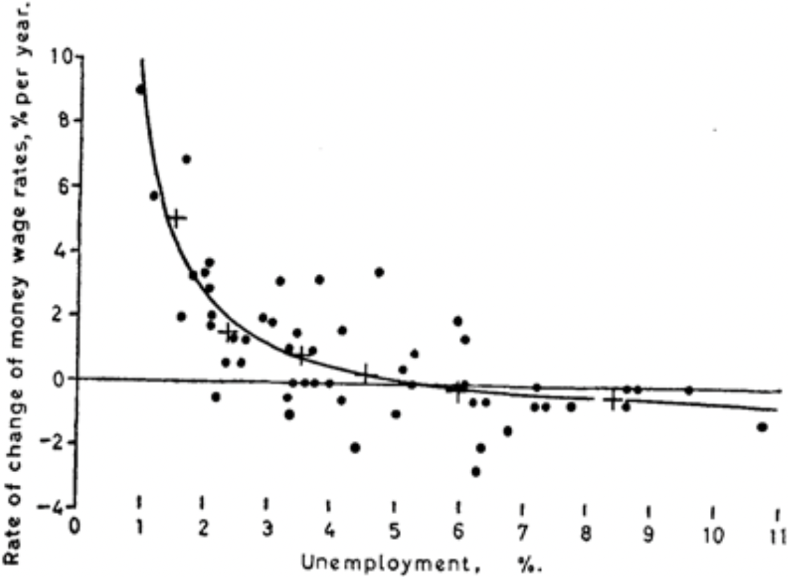
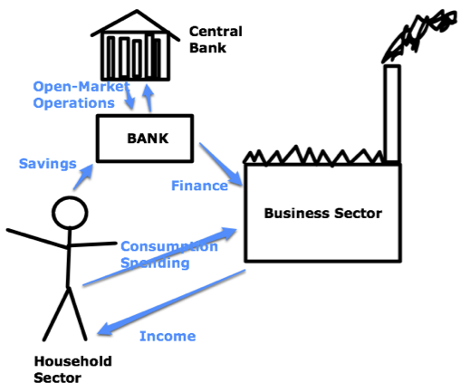

```{r setup, include=FALSE}
library(tidyverse)
library(lubridate)
library(fontawesome)
pro = fontawesome::fa("thumbs-up", fill="green")
con = fontawesome::fa("bomb", fill="orange")
options(htmltools.dir.version = FALSE)
knitr::opts_chunk$set(
  dev = "svg",
  fig.path = "gfx/",
  fig.width=9, fig.height=3.5, fig.retina=3,
  fig.showtext = TRUE,
  out.width = "100%",
  cache = TRUE,
  echo = FALSE,
  message = FALSE, 
  warning = FALSE,
  hiline = TRUE
)
```

```{r xaringan-themer, include=FALSE, warning=FALSE}
library(xaringanthemer)
primary = "#002145"
secondary = "#6495ed"
tertiary = "#ffa319"
fourth_color = "#DB0B5B"

style_duo_accent(
  primary_color      = primary,  #"#002145", # UBC primary
  secondary_color    = secondary,  #"6EC4E8", # UBC secondary 4
  header_font_google = google_font("EB Garamond"),
  text_font_google = google_font("Open Sans"),
  code_font_google = google_font("Fira Mono"),
  text_color = primary,
  table_row_even_background_color = lighten_color(primary, 0.8),
  colors = c(
    tertiary = tertiary, fourth_color = fourth_color,
    light_pri = lighten_color(primary, 0.8),
    light_sec = lighten_color(secondary, 0.8),
    light_ter = lighten_color(tertiary, 0.8),
    light_fou = lighten_color(fourth_color, 0.8)
    ),
  outfile = here::here("docs/src/xaringan-themer.css")
)
# theme_set(theme_xaringan())
```

layout: true

<div class="my-footer"><span><a href="https://dajmcdon.github.io/dsges" style="color:white">dajmcdon.github.io/dsges</a></span></div> 

---

background-image: url("gfx/cover.svg")
background-size: contain
background-position: top

<br/><br/><br/><br/><br/><br/><br/><br/><br/><br/><br/>


.center[# Your model is beautiful, but does it predict?]


.pull-left[
<br/>
###Daniel J. McDonald
###University of British Columbia
#### NeurIPS: I Can't Believe It's Not Better
]

.pull-right[.center[.middle[
<br/>
<table>
<tr>
<td></td>
<td></td>
<td></td>
</tr>
<tr>
<td>`r fa("chalkboard-teacher")` Slides</td>
<td>`r fa("code")` Code</td>
<td>`r fa("at")` My WWW</td>
</tr>
</table>
]]]

???

* Thanks to the organizers for the invitation
* Cosma originally scheduled, but couldn't make it.
* I'll try to do my best impression. 


---

# Themes

</br>

### `r fa("angle-right")` "Beauty" or perhaps "elegance" as a research goal

</br>

### `r fa("angle-right")` A long-gestating paper without a home

</br>

### `r fa("angle-right")` Why are these models .tertiary[still] so bad?

</br>

???

Beauty:

* Connects to the themes of this workshop well, I think.
* The idea that a certain mathematical explanation for a real-world phenomenon is somehow "satisfying" when it incorporates as many of the underlying factors as possible.

Long-gestating:

* I'll describe the details more later, but suffice it to say that this work started 10+ years ago, and still isn't even a completed working paper.

Why:

* Not the first, nor will we be the last to point out the flaws, but the models are still terrible.


--

### `r fa("long-arrow-alt-right", fill=tertiary)` A parable from Macroeconomics


---

.pull-left[

]

.pull-right[


]

???

* I've been teaching undergraduates from these familiar texts.
* Familiar to most in ML: how to understand evaluate predictive models.
* Statistical Models often predict well, even if they are not built up from a realistic model of the world.
* Ridge regression -- no more confidence intervals; p-values
* Random Forests; Boosting; Deep Learning -- non-parametric and hard to interpret as explanatory. But may predict very well.

---
class: middle

<blockquote cite="Jason Zweig, WSJ 8 August 2009"><a href=https://www.wsj.com/articles/SB124967937642715417>Over an 13-year period, [David Leinweber] found, [that annual butter production in Bangladesh] "explained" 75% of the variation in the annual returns of the Standard & Poor’s 500-stock index.</br></br>By tossing in U.S. cheese production and the total population of sheep in both Bangladesh and the U.S., Mr. Leinweber was able to "predict" past U.S. stock returns with 99% accuracy.</a></blockquote>

---
class: middle

### 1. Good prediction is possible despite no structural relationship

</br>

### 2. Erroneously conflating .tertiary[In-sample] accuracy with .tertiary[Out-of-sample] accuracy


</br>

???


* Quote illustrates the point with it's absurdity.
* But is a little bit problematic from a technical point of view. 

---

## What about the reverse? .tertiary[No.]

<br/><br/>

### A correct causal model that gives accurate counterfactual predictions .tertiary[must] make accurate statistical predictions.

<br/><br/>


* Spirtes, Glymour, and Scheines &#8212; Causation, Prediction, and Search (1993)

* Pearl &#8212; Causality: Models, Reasoning, and Inference (2000)

* Morgan and Winship &#8212; Counterfactuals and Causal Inference: Methods and Principles for Social Research (2015, 2ed)

???

* By the contrapositive, inaccurate predictions -> incorrect causal model.

---
class: middle, inverse, center

# Macroeconomics and causal inference

???

* How has macro evolved with causal inference.


---

## Prior to mid-1970s, 
### Macroeconomics focused on empirical relationships

.center[]

.pull-right-wide[.small[Source: [AW Phillips "The Relation Between Unemployment and the Rate of Change of Money Wage Rates in the United Kingdom, 1861–1957"](https://doi.org/10.1111/j.1468-0335.1958.tb00003.x)]]

???

* Illustration of a typical (famous), empirical result in macro.
* Inverse relationship between wages (y-axis) and unemployment.
* Says: "when unemployment is low, we have to pay more to entice people to work"
* Makes perfect sense.
* Due to a number of factors:
    1. Getting those who don't want to work to work.
    2. Leave current job to come work for me. (competition)
    3. On the high side: everyone is looking, so I don't have to compete.

---

.pull-left-narrow[
</br></br>

]

.pull-right-wide[
<blockquote cite="Robert Lucas, Econometric Policy Evaluation: A critique"><a href=https://doi.org/10.1016/S0167-2231(76)80003-6>Given that the structure of an econometric model consists of optimal decision rules of economic agents, and that optimal decision rules vary systematically with changes in the structure of series relevant to the decision maker, it follows that any change in policy will systematically alter the structure of econometric models.</a></blockquote>
]

???

* If I as a central banker or congress "do something", it alters the observed relationship.
* Can't just intervene.
* So the Phillips curve doesn't tell me how to think about policy, only what happens in the absence of policy.
* Sets up a cyclical argument.

--

### The sentiment is really causal inference, but without the language of Pearl

???

* A graphical model illustrates this immediately, but that language wasn't around at the time
* Susan Athey, Guido Imbens and others for lots of fascinating work on Econ and Causal Inference.


---

## Dynamic Stochastic General Equilibrium Models

* Observe the highly aggregated actions of individual agents, and try to learn their reward function.

* Inverse Reinforcement Learning but with tiny amounts data

.pull-left[
\begin{aligned}
\max_{c_t,l_t}U &=E\sum_{t=0}^\infty \beta^tu(c_t,l_t).\\
&\textrm{subject to}\\
 y_t &= z_t g(k_t,n_t),\\
 1 &= n_t + l_t \\
 y_t &= c_t + i_t \\
 k_{t+1} &= i_t + (1-\delta)k_t \\
 \ln z_t &= (1-\rho)\ln\overline{z} + \rho\ln z_{t-1} + \epsilon_t \\
 \epsilon_t &\stackrel{iid}{\sim} \mbox{N}(0,\ \sigma_\epsilon^2).
\end{aligned}
]

.pull-right[


.pull-right-narrow[.small[Source: [Brad Delong](https://www.bradford-delong.com) ]]
]

???

* Add "microfoundations" whose "deep" parameters are invariant to policy. (Supposedly.)
* Then I can "directly" intervene and see what happens.
* The model is for an individual, and then we assume that all individuals are the same, and then we assume that the aggregate looks like an individual.
* [Matthew Jackson and Leeat Yariv](https://doi.org/10.2139/ssrn.2684776) argue that this last assumption is false for most DSGE specifications.

* Don't observe the individual driver, but maybe "the number of crashes and the total number of parking tickets in the country in a 3 month period"


---

<blockquote cite='"On DSGE Models" by Christino, Eichenbaum, and Trabandt (2017 Working paper version)'><a href=https://faculty.wcas.northwestern.edu/~yona/research/DSGE.pdf>
People who don’t like dynamic stochastic general equilibrium (DSGE) models are dilettantes. By this we mean they aren’t serious about policy analysis.</a> 
<!--Why do we say this? ... As Lucas (1980) pointed out roughly forty years ago, the only place that we can do experiments is in our models. Dilettantes who only point to the existence of competing forces at work – and informally judge their relative importance via implicit thought experiments – can never give serious policy advice.-->
</blockquote>

--

<blockquote cite='"Where Modern Macroeconomics Went Wrong" by Joseph Stiglitz'><a href=https://www.ineteconomics.org/uploads/papers/Where-Modern-Macroeconomics-Went-Wrong.pdf>I believe that most of the core constituents of the DSGE model are flawed—sufficiently badly flawed that they do not provide even a good starting point for constructing a good macroeconomic model.</a></blockquote>

???

* Stiglitz is far from the only critical voice (or even critical laureate). See Robert Solow's testimony before the House in 2010, Brad Delong, Robert Waldman, Chris Sims, and others.

--

### I guess I'm a dilettante, but at least I'm in good company.

---

## Long in development with no where to go

I started (and mostly finished) this work in 2009 with Cosma Shalizi and Mark Schervish, at the beginning of my PhD.

Gets revisited every 3 years. Mostly "on the backburner"

???

* Largely the "exploration" phase of my thesis work. 
* I was interested in this because I'd worked at the Fed. But wasn't exactly sure what my contribution would be.
* Coincided with the Financial Crisis of 2008-09. 
* Got funded by the first INET Grant cycle (George Soros), so that I could avoid TA duties over the summer.

* Not obvious how spending a lot of time on it would lead to tenure. Not clear it has any Journal home.


--

<br/><br/>

### The original question: "Why didn't these models predict the Financial Crisis?"

<br/><br/>

* .secondary[Macroeconomics answer:] because they were missing important structural mechanisms `r fa("long-arrow-alt-right", fill=tertiary)` lets add them

* .secondary[Our answer:] because they don't predict .tertiary[anything], you just got lucky up to now.

???

* Thesis work ended up focusing on proving that latter for time series (learning theory), rather than the empirical demonstration.


---

## Exploratory behaviour you should demand.

<br/><br/>

### 3 things your beautiful model should do:

<br/><br/>

<table style="width: 100%; vertical-align:top">
<tr>
<td style="width:33%; vertical-align:top">.center[.secondary[.huge[1.]]] <br/>Be internally consistent: if you simulate it, and train on the simulation, you should eventually recover the truth.</td>
<td style="width:33%; vertical-align:top">.center[.secondary[.huge[2.]]] <br/>It should work better on real data than it does on nonsense.</td>
<td style="width:33%; vertical-align:top">.center[.secondary[.huge[3.]]] <br/>It should predict as well as simple baselines (if not better).</td>
<tr>
<table>

???

* First two are about matching reality.
* The third is more about defining what we mean by "predict well". 
* We don't have a "bakeoff" like with the digits data or ImageNet. 
* Fall back on something like "does it do better than random guessing". Standard with AUC analysis, etc.

---
class: middle, inverse, center

# So how does the DSGE do?

--

.huge[1.] Repeat many times:

Simulate lots of data. Train on increasingly long periods. Predict.

---

## 1. Are it's parameter estimates consistent? .tertiary[No.]

```{r parm-estimates}
load(here::here("cluster_output", "SimEst", "summaryStats.Rdata"))
SummaryStats %>%
  group_by(nestim) %>%
  summarise(quant(perror)) %>%
  pivot_wider() %>%
  ggplot(aes(nestim / 4)) +
  theme_bw() +
  annotate("rect", ymin = -Inf, ymax = Inf, xmin = -Inf, xmax = 60, 
           fill = "lightsteelblue1", alpha = .5) +
  geom_ribbon(aes(ymin=`10%`,ymax=`90%`), fill='grey90') +
  geom_ribbon(aes(ymin=`25%`,ymax=`75%`), fill='grey80') + 
  geom_line(aes(y = avg), color = "cornflowerblue", size = 1.5) + 
  geom_line(aes(y = `50%`), color = "orange", size = 1.5) +
  xlab('Years of training data') +
  ylab("Mean-squared parameter error")
```

.secondary[.large[Might be OK.]]


???

* Note the light blue window.
* Emphasize: 
    1. used the published model parameters. 
    2. Years of data
    3. Blue/Orange lines
    4. CI bands are quantiles over replicates (50/80)

* Perhaps not identifiable.
* Local minima might still yield good predictors 
* But if so, it undermines model interpretability 

---

## 1. Can it eventually predict it's own data? .tertiary[No.]

```{r individual-series, fig.height=4.25}
load(here::here("cluster_output", "SimEst", "predErrs.Rdata"))
load(here::here("cluster_output", "SimEst", "baselineErrs.Rdata"))
quant <- function(x) 
  enframe(c(avg = mean(x), quantile(x, c(.1,.25,.5,.75,.9))))
prederrs = pred.errs.sc %>% select(-prob,-algo,-repl) %>%
  pivot_longer(labobs:dw, names_to = "series", values_to = "mspe")
baseline = base.errs.sc %>% select(-prob,-algo,-repl) %>%
  pivot_longer(labobs:dw, names_to = "series", values_to = "bmspe")
df = full_join(prederrs, baseline) %>% 
  mutate(excess = log(mspe) - log(bmspe),
         series = fct_recode(
           series, 
           Consumption = "dc", Investment = "dinve", Wages = "dw",
           Output = "dy", `Hours worked` = "labobs", 
           Inflation = "pinfobs", `Interest rate` = "robs")) %>%
  group_by(series, nestim) %>%
  summarise(quant(excess)) %>%
  pivot_wider()
df %>% ggplot(aes(nestim / 4)) + 
  theme_bw() +
  scale_y_continuous(labels = scales::percent_format(accuracy = 1)) +
  facet_wrap(~ series) + #scale_y_log10() +
  annotate("rect", ymin = -Inf, ymax = Inf, xmin = -Inf, xmax = 60, 
           fill = "lightsteelblue1", alpha = .5) +
  geom_ribbon(aes(ymin=`10%`,ymax=`90%`), fill='grey90') + 
  geom_ribbon(aes(ymin=`25%`,ymax=`75%`), fill='grey80') + 
  geom_line(aes(y=avg), color = "cornflowerblue", size = 1.5) + 
  geom_line(aes(y=`50%`), color = "orange", size = 1.5) +
  coord_cartesian(ylim=c(.01, .25)) +
  xlab('Years of training data') + 
  ylab('Increase in MSE relative to the oracle') +
  theme(strip.background = element_rect(fill = NA, linetype = "blank"), 
        strip.text = element_text(hjust = 0))
```

???

* Relative to the model that generated the data (don't learn the parameters).

---

## 2. Mess with it's brain: just relabel all the series

This model is not symmetric in the inputs/outputs. They're meaningful (supposedly)

Example: Give it Income where it thinks it's getting the Interest Rate, re-train the model, and produce out-of-sample predictions.

```{r filpping-processing, include=FALSE}
load(here::here("cluster_output","perm_results.Rdata"))
load(here::here("data", "SWdataUpdated.Rdata"))
source(here::here('code', 'functions', 'modelsol.R'))
trainset = 1:200
testset = (1:ncol(y))[-trainset]
sc = t(apply(y,1,var))
perms = perm(7,7)
SWPerm = perms[1,]
truePerm = 1
unPerm = t(apply(perms,1,function(x) match(1:7,x)))
series = rownames(y)
testerr = matrix(NA, nrow(perms),7)
for(i in 1:nrow(test_mse)) testerr[i,] = test_mse[i,][unPerm[i,]] # unscramble the permuted test errors
testerr = data.frame(testerr)
names(testerr) = c('hours worked','interest rate','inflation','output','consumption','investment','wages') #series
# baseline = testerr[truePerm,]

scMSE = sweep(testerr, 2, sc, '/')
nperms <- nrow(testerr)
df = tibble(y = scMSE %>% rowMeans() %>% sort(), x = 1:nperms)
scMSEtrue = mean(unlist(scMSE[truePerm,]))
imp = round(mean(df$y<scMSEtrue)*100, 2)
```

```{r flipping-plot, fig.height=3}
ggplot(df, aes(y)) + 
  geom_histogram(bins = 50, fill = "cornflowerblue", color = "black") + 
  geom_vline(xintercept=scMSEtrue,color="orange", size = 1.5) + 
  xlab('Out-of-sample scaled MSE') + 
  scale_x_log10() +
  theme_bw() +
  scale_y_continuous(expand = expansion(c(0,.05)))
  # xlab(paste0(imp,"% improved")) + 
```

* Of `r nperms` permutations, about `r round(imp, 0)`% of the "wrong" ones are better.

---

## 3. Compare to simple baselines

<blockquote cite='"How Useful Are Estimated DSGE Model Forecasts for Central Bankers?" by Edge and G&#252rkaynak'><a href=https://www.jstor.org/stable/41012847>In line with the results in the DSGE model forecasting literature, we found that the root mean squared errors (RMSEs) of the DSGE model forecasts were similar to, and .secondary[often better than], those of the BVAR and Greenbook forecasts. [However...] these models [all] showed [...] almost no forecasting ability. Thus, our comparison is not between one good forecast and another; rather, .secondary[all three methods of forecasting are poor]....</a></blockquote>


???

* Define BVAR
* Define Greenbook


---
class: middle, center, inverse

# Bad models are used in other fields, too.

???

* About 16 months deploying and especially evaluating COVID forecasts.

---

## Forecasting COVID-19 Incident Cases in the US

* 20 months later, why are so many models worse than [Baseline](https://delphi.cmu.edu/forecast-eval/)? 

```{r grab-cases}
Mean <- function(x) mean(x, na.rm = TRUE)
GeoMean <- function(x, y = NULL, offset = 0) {
  x <- x + offset
  if (!is.null(y)) y <- y + offset
  else y <- 1
  exp(Mean(log(x / y)))
}
library(aws.s3)
Sys.setenv("AWS_DEFAULT_REGION" = "us-east-2")
s3bucket <- get_bucket("forecast-eval")
case_scores <- s3readRDS("score_cards_state_cases.rds", s3bucket) %>%
  select(ahead:forecaster, target_end_date, wis) %>%
  mutate(forecast_date = target_end_date - 7 * ahead)
dumpc <- case_scores %>% group_by(forecaster) %>% summarise(n = n()) #%>%
  #filter(n > 4 * 4 * 50 * 4) # Currently showing all
case_scores <- case_scores %>% 
  filter(forecaster %in% pull(dumpc, forecaster))
base_case <- case_scores %>% filter(forecaster == "COVIDhub-baseline")
case_scores <- left_join(
  case_scores %>% filter(forecaster != "COVIDhub-baseline"),
  base_case %>% rename(base_wis = wis) %>% 
    select(forecast_date, target_end_date, geo_value, base_wis)) %>% 
  group_by(forecaster, ahead) %>%
  summarise(relwis = GeoMean(wis, base_wis, offset = 1))
```

```{r overall-cases, fig.height=3.5}
library(gghighlight)
selected <- c("COVIDhub-trained_ensemble", "COVIDhub-ensemble")
ggplot(case_scores,
    aes(ahead, relwis, color = forecaster)) +
  geom_line(size = 1.5) +
  gghighlight(forecaster %in% selected, use_direct_label = FALSE,
              unhighlighted_params = list(size = 1)) +
  geom_hline(yintercept = 1, color = "black", size = 1.5) +
  ylab("Geometric mean of WIS\n relative to baseline") +
  xlab("Weeks ahead") +
  theme_bw() +
  scale_color_manual(values = c("cornflowerblue", "orange")) +
  theme(legend.position = "bottom", legend.title = element_blank())
```

* Of `r n_distinct(case_scores$forecaster) - 4` teams, `r case_scores %>% group_by(forecaster) %>% summarise(m = median(relwis, na.rm = TRUE)) %>% filter(m<1) %>% nrow()-4` routinely beat the baseline.

???

* Lines are Official CDC forecast (blue), pilot ensemble that uses recent skill (orange)
* The score is for quantile forecasts. See more at Covid19Forecast Hub.
* Very hard problem. Many teams are bad, but bad at different times.
* Weighting by Recent performance doesn't seem to help the way it should.
* This is a public evaluation (so you can recreate this and see who's doing well).


---

## Conclusions

1. Models that predict well can be useless for policy.

2. Models that predict poorly require serious caveats / justification before using for policy.

3. This is hard with social science.  
    In many other fields, we discard models that predict poorly (particle physics, astronomy, medicine, etc.)

4. Suggested minimal criteria for a policy-relevant model:
    - Internally consistent.
    - Robust to nonsense.
    - Better than simple baselines.
--
    - Others??
    
???

* Worth codifying some standard metrics to subject your new model too.
* Perhaps the same "public" declarations like medical studies.
* Just because it "controls for" or "includes" some potentially relevant feature doesn't mean it's better.

 
---

## Thanks

.pull-left[.center[


]]

.pull-right[
.center[


]]

--

.center[.huge[`r fa("exclamation-triangle", fill=secondary)` .secondary[ICBINB Organizers] `r fa("exclamation-triangle", fill=secondary)`]]

???

* Aaron, Jessica, Stephanie, Francisco, and Melanie