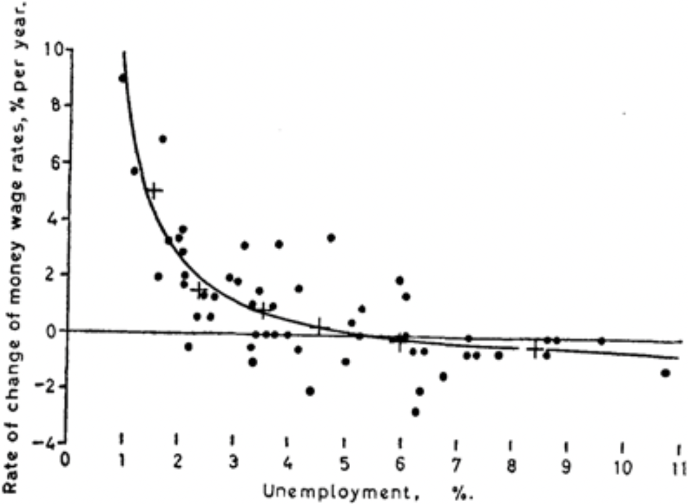
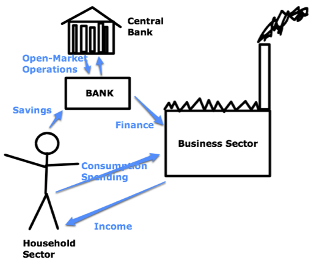

```{r setup, include=FALSE}
library(tidyverse)
library(lubridate)
library(covidcast)
pro = fontawesome::fa("thumbs-up", fill="green")
con = fontawesome::fa("bomb", fill="orange")
options(htmltools.dir.version = FALSE)
knitr::opts_chunk$set(
  dev = "svg",
  fig.width=9, fig.height=3.5, fig.retina=3,
  fig.showtext = TRUE,
  out.width = "100%",
  cache = TRUE,
  echo = FALSE,
  message = FALSE, 
  warning = FALSE,
  hiline = TRUE
)
```

```{r xaringan-themer, include=FALSE, warning=FALSE}
library(xaringanthemer)
primary = "#002145"
secondary = "#6ec4e8"
tertiary = "#0076A5"
fourth_color = "#DB0B5B"

style_duo_accent(
  primary_color      = primary,  #"#002145", # UBC primary
  secondary_color    = secondary,  #"6EC4E8", # UBC secondary 4
  header_font_google = google_font("EB Garamond"),
  text_font_google = google_font("Open Sans"),
  code_font_google = google_font("Fira Mono"),
  table_row_even_background_color = lighten_color(primary, 0.8),
  colors = c(
    tertiary = tertiary, fourth_color = fourth_color,
    light_pri = lighten_color(primary, 0.8),
    light_sec = lighten_color(secondary, 0.8),
    light_ter = lighten_color(tertiary, 0.8),
    light_fou = lighten_color(fourth_color, 0.8)
    ),
  title_slide_background_image = "corona.jpeg",
  #title_slide_background_position = "75% 75%",
  #title_slide_background_size = "200px 200px"
  title_slide_text_color = "#FFFFFF"
)
# theme_set(theme_xaringan())
```

# Themes

</br>

### "Beauty" or perhaps "intellectual satisfaction" as a research goal

</br>

### A long-gestating paper without a home

</br>

### Why are these models still so bad?

</br>

--

### $\Longrightarrow$ A parable from Macroeconomics

---

.pull-left[

]

.pull-right[


]

---
class: middle

<blockquote cite="Carl Richards, NYT 26 March 2012">Over an 13-year period, [David Leinweber] found, [that annual butter production in Bangladesh] “explained” 75% of the variation in the annual returns of the Standard & Poor’s 500-stock index.</br></br>By tossing in U.S. cheese production and the total population of sheep in both Bangladesh and the U.S., Mr. Leinweber was able to “predict” past U.S. stock returns with 99% accuracy.</blockquote>

---
class: middle

### 1. Good prediction is possible despite no structural relationship

</br>

### 2. Erroneously conflating .secondary[In-sample] accuracy with .secondary[Out-of-sample] accuracy


</br>

---

## Prior to mid-1970s, 
### Macroeconomics focused on empirical relationships

.center[]

Source: AW Phillips "The Relation Between Unemployment and the Rate of Change of Money Wage Rates in the United Kingdom, 1861–1957"


---
class: middle

.pull-left-narrow[
</br></br>

]

.pull-right-wide[
<blockquote cite="Robert Lucas, Econometric Policy Evaluation: A critique">Given that the structure of an econometric model consists of optimal decision rules of economic agents, and that optimal decision rules vary systematically with changes in the structure of series relevant to the decision maker, it follows that any change in policy will systematically alter the structure of econometric models.</blockquote>
]

--

### The sentiment is really causal inference, but without the language of Pearl

---

## Response: Dynamic Stochastic General Equilibrium Models

* Observe the highly aggregated actions of individual agents, and try to learn their reward function.

* Inverse Reinforcement Learning but with tiny amounts data

.pull-left[
\begin{aligned}
\max_{c_t,l_t}U &=E\sum_{t=0}^\infty \beta^tu(c_t,l_t).\\
&\textrm{subject to}\\
 y_t &= z_t g(k_t,n_t),\\
 1 &= n_t + l_t \\
 y_t &= c_t + i_t \\
 k_{t+1} &= i_t + (1-\delta)k_t \\
 \ln z_t &= (1-\rho)\ln\overline{z} + \rho\ln z_{t-1} + \epsilon_t \\
 \epsilon_t &\stackrel{iid}{\sim} \mbox{N}(0,\ \sigma_\epsilon^2).
\end{aligned}
]

.pull-right[


Source: [Brad Delong](https://www.bradford-delong.com) 
]

---

<blockquote cite='"On DSGE Models" by Christino, Eichenbaum, and Trabandt (2017 Working paper version)'>
People who don’t like dynamic stochastic general equilibrium (DSGE) models are dilettantes. By this we mean they aren’t serious about policy analysis. 
<!--Why do we say this? ... As Lucas (1980) pointed out roughly forty years ago, the only place that we can do experiments is in our models. Dilettantes who only point to the existence of competing forces at work – and informally judge their relative importance via implicit thought experiments – can never give serious policy advice.-->
</blockquote>

--

<blockquote cite='"Where Modern Macroeconomics Went Wrong" by Joseph Stiglitz'>I believe that most of the core constituents of the DSGE model are flawed—sufficiently badly flawed that they do not provide even a good starting point for constructing a good macroeconomic model.</blockquote>

--

### I guess I'm a dilettante, but at least I'm in good company.

---

## Long in development with no where to go

I started (and mostly finished) this work in 2009 with Cosma Shalizi and Mark Schervish, at the beginning of my PhD.

Gets revisited every 3 years. Mostly "on the backburner"

### The question: "Why didn't these models predict the Financial Crisis?"

* Macroeconomics answer: because they were missing important structural mechanisms $\longrightarrow$ lets add them

* Our answer: because they don't predict .fourth-color[anything], you just got lucky up to now.

--

3 things your beautiful model should do:

1. Be internally consistent: if you simulate it, and train on the simulation, you should eventually recover the truth.
2. It should work better on real data than it does on nonsense.
3. It should predict as well as simple baselines (if not better).


---

## 1. A DSGE is a model, can it predict it's own data?

```{r individual-series, fig.height=4.25}
load(here::here("cluster_output", "SimEst", "predErrs.Rdata"))
load(here::here("cluster_output", "SimEst", "baselineErrs.Rdata"))
quant <- function(x) 
  enframe(c(avg = mean(x), quantile(x, c(.1,.25,.5,.75,.9))))
prederrs = pred.errs.sc %>% select(-prob,-algo,-repl) %>%
  pivot_longer(labobs:dw, names_to = "series", values_to = "mspe")
baseline = base.errs.sc %>% select(-prob,-algo,-repl) %>%
  pivot_longer(labobs:dw, names_to = "series", values_to = "bmspe")
df = full_join(prederrs, baseline) %>% 
  mutate(excess = log(mspe) - log(bmspe),
         series = fct_recode(
           series, 
           Consumption = "dc", Investment = "dinve", Wages = "dw",
           Output = "dy", `Hours worked` = "labobs", 
           Inflation = "pinfobs", `Interest rate` = "robs")) %>%
  group_by(series, nestim) %>%
  summarise(quant(excess)) %>%
  pivot_wider()
df %>% ggplot(aes(nestim / 4)) + 
  theme_bw() +
  scale_y_continuous(labels = scales::percent_format(accuracy = 1)) +
  facet_wrap(~ series) + #scale_y_log10() +
  annotate("rect", ymin = -Inf, ymax = Inf, xmin = -Inf, xmax = 60, 
           fill = "lightsteelblue1", alpha = .5) +
  geom_ribbon(aes(ymin=`10%`,ymax=`90%`), fill='grey90') + 
  geom_ribbon(aes(ymin=`25%`,ymax=`75%`), fill='grey80') + 
  geom_line(aes(y=avg), color = "cornflowerblue", size = 1.5) + 
  geom_line(aes(y=`50%`), color = "orange", size = 1.5) +
  coord_cartesian(ylim=c(.01, .25)) +
  xlab('Years of training data') + 
  ylab('Increase in MSE relative to the oracle') +
  theme(strip.background = element_rect(fill = NA, linetype = "blank"), 
        strip.text = element_text(hjust = 0))
```

---

## 1. Are it's parameter estimates consistent?

```{r parm-estimates}
load(here::here("cluster_output", "SimEst", "summaryStats.Rdata"))
SummaryStats %>%
  group_by(nestim) %>%
  summarise(quant(perror)) %>%
  pivot_wider() %>%
  ggplot(aes(nestim / 4)) +
  theme_bw() +
  annotate("rect", ymin = -Inf, ymax = Inf, xmin = -Inf, xmax = 60, 
           fill = "lightsteelblue1", alpha = .5) +
  geom_ribbon(aes(ymin=`10%`,ymax=`90%`), fill='grey90') +
  geom_ribbon(aes(ymin=`25%`,ymax=`75%`), fill='grey80') + 
  geom_line(aes(y = avg), color = "cornflowerblue", size = 1.5) + 
  geom_line(aes(y = `50%`), color = "orange", size = 1.5) +
  xlab('Years of training data') +
  ylab("Mean-squared parameter error")
```

---

## 2. Mess with it's brain: just relabel all the series

This model is not symmetric in the inputs/outputs. They're meaningful (supposedly)

Example: Give it Income where it thinks it's getting the Interest Rate, re-train the model, and produce out-of-sample predictions.

```{r filpping-processing, include=FALSE}
load(here::here("cluster_output","perm_results.Rdata"))
load(here::here("data", "SWdataUpdated.Rdata"))
source(here::here('code', 'functions', 'modelsol.R'))
trainset = 1:200
testset = (1:ncol(y))[-trainset]
sc = t(apply(y,1,var))
perms = perm(7,7)
SWPerm = perms[1,]
truePerm = 1
unPerm = t(apply(perms,1,function(x) match(1:7,x)))
series = rownames(y)
testerr = matrix(NA, nrow(perms),7)
for(i in 1:nrow(test_mse)) testerr[i,] = test_mse[i,][unPerm[i,]] # unscramble the permuted test errors
testerr = data.frame(testerr)
names(testerr) = c('hours worked','interest rate','inflation','output','consumption','investment','wages') #series
# baseline = testerr[truePerm,]

scMSE = sweep(testerr, 2, sc, '/')
nperms <- nrow(testerr)
df = tibble(y = scMSE %>% rowMeans() %>% sort(), x = 1:nperms)
scMSEtrue = mean(unlist(scMSE[truePerm,]))
imp = round(mean(df$y<scMSEtrue)*100, 2)
```

```{r flipping-plot, fig.height=3}
ggplot(df, aes(y)) + 
  geom_histogram(bins = 50, fill = "cornflowerblue", color = "black") + 
  geom_vline(xintercept=scMSEtrue,color="orange", size = 1.5) + 
  xlab('Out-of-sample scaled MSE') + 
  scale_x_log10() +
  theme_bw() +
  scale_y_continuous(expand = expansion(c(0,.05)))
  # xlab(paste0(imp,"% improved")) + 
```

* Of `r nperms` permutations, about `r round(imp, 0)`% of the "wrong" ones are better.

---

## 3. Compare to simple baselines

<blockquote cite='"How Useful Are Estimated DSGE Model Forecasts for Central Bankers?" -- Edge and G&#252rkaynak'>In line with the results in the DSGE model forecasting literature, we found that the root mean squared errors (RMSEs) of the DSGE model forecasts were similar to, and often better than, those of the BVAR and Greenbook forecasts. [However...] these models [all] showed [...] almost no forecasting ability. Thus, our comparison is not between one good forecast and another; rather, all three methods of forecasting are poor....</blockquote>


---

## Forecasting COVID-19 in the US

* 20 months later, why are so many models worse than Baseline? 

```{r grab-cases}
Mean <- function(x) mean(x, na.rm = TRUE)
GeoMean <- function(x, y = NULL, offset = 0) {
  x <- x + offset
  if (!is.null(y)) y <- y + offset
  else y <- 1
  exp(Mean(log(x / y)))
}
library(aws.s3)
Sys.setenv("AWS_DEFAULT_REGION" = "us-east-2")
s3bucket <- get_bucket("forecast-eval")
case_scores <- s3readRDS("score_cards_state_cases.rds", s3bucket) %>%
  select(ahead:forecaster, target_end_date, wis) %>%
  mutate(forecast_date = target_end_date - 7 * ahead)
dumpc <- case_scores %>% group_by(forecaster) %>% summarise(n = n()) #%>%
  #filter(n > 4 * 4 * 50 * 4) # Currently showing all
case_scores <- case_scores %>% 
  filter(forecaster %in% pull(dumpc, forecaster))
base_case <- case_scores %>% filter(forecaster == "COVIDhub-baseline")
case_scores <- left_join(
  case_scores %>% filter(forecaster != "COVIDhub-baseline"),
  base_case %>% rename(base_wis = wis) %>% 
    select(forecast_date, target_end_date, geo_value, base_wis)) %>% 
  group_by(forecaster, ahead) %>%
  summarise(relwis = GeoMean(wis, base_wis, offset = 1))
```

```{r overall-cases, fig.height=3.5}
library(gghighlight)
selected <- c("COVIDhub-trained_ensemble", "COVIDhub-ensemble")
ggplot(case_scores,
    aes(ahead, relwis, color = forecaster)) +
  geom_line(size = 1.5) +
  gghighlight(forecaster %in% selected, use_direct_label = FALSE,
              unhighlighted_params = list(size = 1)) +
  geom_hline(yintercept = 1, color = "black", size = 1.5) +
  ylab("Geometric mean of WIS\n relative to baseline") +
  xlab("Weeks ahead") +
  theme_bw() +
  scale_color_manual(values = c("cornflowerblue", "orange")) +
  theme(legend.position = "bottom", legend.title = element_blank())
```

* Of `r n_distinct(case_scores$forecaster) - 4` teams, `r case_scores %>% group_by(forecaster) %>% summarise(m = median(relwis, na.rm = TRUE)) %>% filter(m<1) %>% nrow()-4` routinely beat the baseline.

